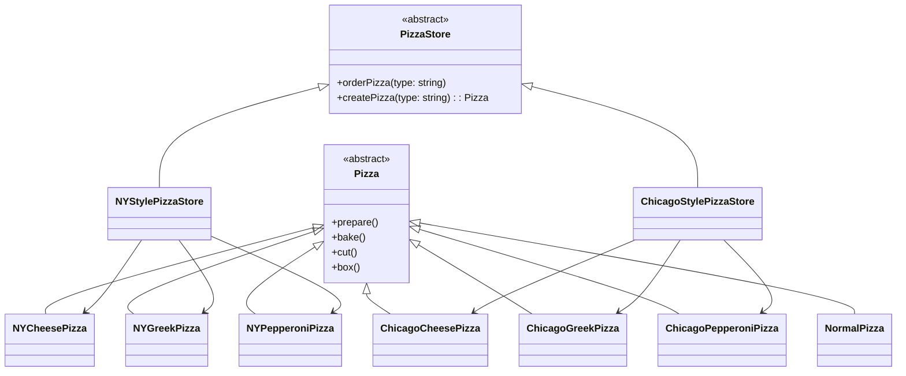

# 工厂方法模式

工厂方法模式定义了一个创建对象的接口，但由子类决定要实例化的类是哪一个。工厂方法让类把实例化推迟到子类。该模式由创建者类和产品类组成。

```ts
abstract class Pizza {
  /** 准备操作 */
  prepare() {}
  /** 烘烤操作 */
  bake() {}
  /** 裁剪操作 */
  cut() {}
  /** 打包操作 */
  box() {}
}

class NormalPizza extends Pizza {}

abstract class PizzaStore {
  orderPizza(type: string) {
    const pizza = this.createPizza(type);

    pizza.prepare();
    pizza.bake();
    pizza.cut();
    pizza.box();

    return pizza;
  }

  abstract createPizza(type: string): Pizza;
}

class NYCheesePizza extends Pizza {}
class NYGreekPizza extends Pizza {}
class NYPepperoniPizza extends Pizza {}

class NYStylePizzaStore extends PizzaStore {
  createPizza(type: string) {
    if (type === "cheese") {
      return new NYCheesePizza();
    } else if (type === "greek") {
      return new NYGreekPizza();
    } else if (type === "pepperoni") {
      return new NYPepperoniPizza();
    } else {
      return new NormalPizza();
    }
  }
}

class ChicagoCheesePizza extends Pizza {}
class ChicagoGreekPizza extends Pizza {}
class ChicagoPepperoniPizza extends Pizza {}

class ChicagoStylePizzaStore extends PizzaStore {
  createPizza(type: string) {
    if (type === "cheese") {
      return new ChicagoCheesePizza();
    } else if (type === "greek") {
      return new ChicagoGreekPizza();
    } else if (type === "pepperoni") {
      return new ChicagoPepperoniPizza();
    } else {
      return new NormalPizza();
    }
  }
}
```


